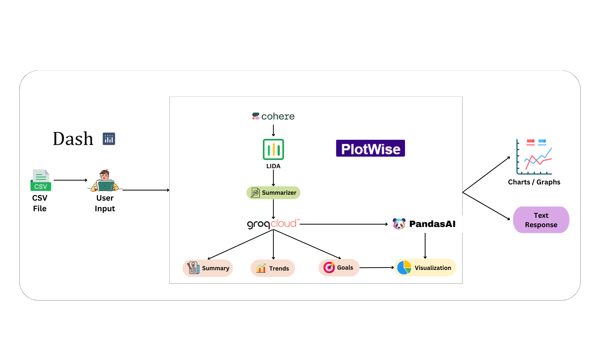
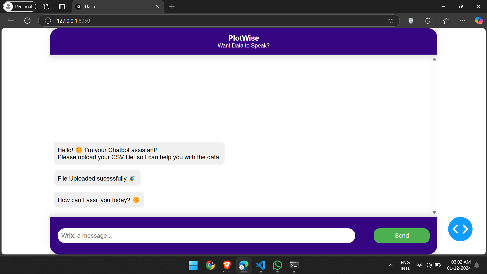
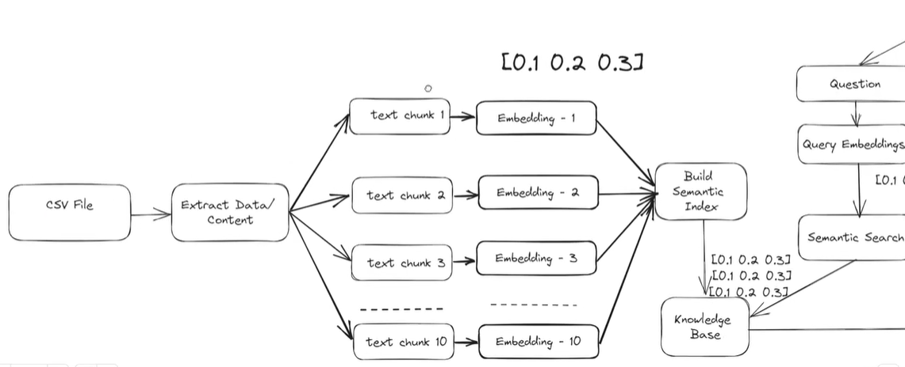

[](https://plotly.com/dash/)
[](https://gemini.com/)
[](https://cohere.ai/)
[](https://microsoft.github.io/lida/)
[](https://github.com/microsoft/lida)


# PlotWise: A chatbot assistant to analyze and visualize your data effortlessly 📈📊

Imagine a world where data analysis and visualization come alive seamlessly 🌟.

Features:
1) **Chat with your data:** Ask questions and get real-time insights effortlessly.
2) **Unlock potential:** Make informed decisions in business, education, and research.
3) **See it clearly:** Turn complex datasets into stunning, easy-to-understand visuals.
Break barriers in data interpretation and let PlotWise do the heavy lifting!


# Chatbot Architecture



🎥 **Watch the demo of PlotWise in action** to see how it can help you interact with your data effortlessly!

👉 [Click here to watch the demo](https://drive.google.com/file/d/1TnhZmqlaYq7BXWTJyvr9edGDUXx3v22v/view?usp=sharing)

**Problems Faced:**

1) I set up the Hugging Face LLaMA model locally, but it was too slow due to my computer's specs.
2) I initially set up Lida using the PaLM API, but then switched to Cohere.
3) faced problem with Configuration of llm in lida
4) I encountered a problem with chart visualization using Lida: "Index out of range for img."


## Setup

Follow these steps to set up the project locally:

### 1. Clone the Repository

Clone this repository to your local machine using the following command:

```bash
git clone https://github.com/call-meRavi-SHORT-CODE/PlotWise.git 
```
### 2. Installing Dependencies

 Run to install the necessary packages.
 ```bash
 pip install -r requirements.txt` 
```
### 3. Set your API key

```bash
os.environ['GOOGLE_API_KEY'] = "your_gemini_api_key" # Gemini API key
GOOGLE_API_KEY = os.environ.get('GOOGLE_API_KEY') 
genai.configure(api_key=GOOGLE_API_KEY)
os.environ["COHERE_API_KEY"] = "your_cohere_api_key"  # Cohere API key
```
### 4. Set your CSV data Path

```bash
csv = "file_path" # replace your file path here
```

### 5. Run
```bash
python app.py
```
Click http://127.0.0.1:8050/




# Failure Approach 1 ❌👎
This was my first approach for the assignment which ended in failure.


